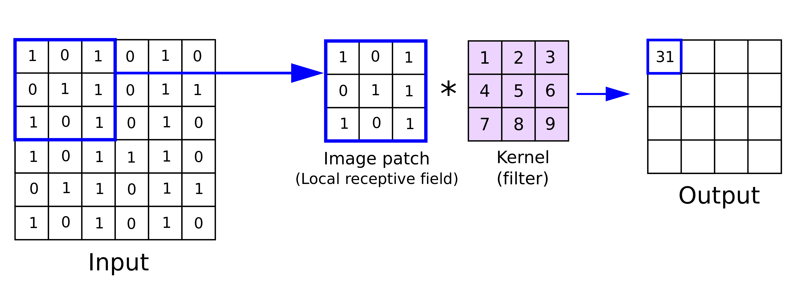
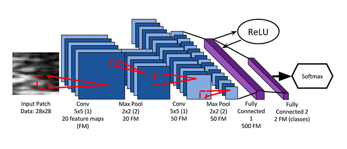

## Convolutional Neural Networks (CNNs)

Convolutional Neural Networks (CNNs) are a category of deep neural networks designed specifically for processing structured matrix data, such as images. The neurons in this case are still present but in a structured two or hgher dimensional space. Each element of such matrix then represents one neuron with learnable coefficient assigned to it. The fundamental building block of a CNN is the convolutional layer, which performs a convolution operation. Mathematically, given an input matrix I and a kernel K, the convolution operation is defined as:

$$ (I \ast K)(x, y) = \sum_{i=-\infty}^{\infty} \sum_{j=-\infty}^{\infty} I(i, j) K(x-i, y-j) $$

In the context of CNNs, I represents a section of the input image, and K is a filter or kernel. The convolution operation involves sliding the kernel over the input image and computing the sum of element-wise products.  Essentially, a convolution is the dot product of two matrices: a kernel and an image patch of identical size.


 A typical CNN comprises convolutional layers, pooling layers, and fully connected layers.

### How do convolutional layers learn patens in image?
Convolutional layers are matrices that have a learnable elements and they can thus represent basically any digital image processing filter. Learning differetn processing filters enables the models to learn to detect different features of the image usuch as edges, long objects, colour changes, texture changes and much more by merely changing the digital representation of the analog filter. One such example isedge detection. Edge detection exemplifies convolution's capability to pinpoint areas in an image where color or intensity undergoes a sudden change. It can be vertical, detecting sharp edges in the middle of the original image, or horizontal, revealing changes from bright to dark and vice versa. Various filters can be employed, and their parameters, including size and matrix elements, can be trained by neural networks.


An example of vertical edge detection

## Padding and Its Importance
Padding addresses the reduction in image size post each convolutional layer and the potential loss of valuable information from the image's edge. It involves adding extra layers of zeros around the original image, maintaining the input image size and preventing information loss.

### Diving Deeper into Convolutional Layers
Convolutional operators can be applied with different strides, affecting the number of operations and the output image size. The number of channels should align between the input image and the filter. Multiple filters can be applied to each image, and the number of parameters to be learned in each layer is independent of the input image size, resolving issues related to overfitting and computational costs.

### Pooling Layers: A Closer Look
Pooling layers aim to condense the representation, retaining only significant features. They are applied similarly to convolution operators and are crucial in reducing overfitting. The most common type is Max Pooling, and it is applied to each channel individually.
In order to build a basic CNN in this section the following funcitons are crucial:

    
  `torch.nn.Conv2d`: PyTorch’s implementation of convolutional layers.

  
  `torch.nn.Linear`: Fully connected layers.

  `torch.nn.MaxPool2d`: Applies 2D max-pooling to reduce the spatial dimensions of the input volume.

  
  `torch.nn.ReLU`: Our ReLU function.

  
  `torch.nn.LogSoftmax`: Used when building our softmax classifier to return the predicted probabilities of each class.

  
  `torch.nn.flatten`: Flattens the output of a multi-dimensional volume (e.g., a CONV or POOL layer) such that we can apply fully connected layers to it.


### The Seminal LeNet Architecture

The Convolutional Neural Network (CNN) we are implementing here with PyTorch is the seminal LeNet architecture, first proposed by one of the grandfathers of deep learning, Yann LeCunn. By today’s standards, LeNet is a very shallow neural network, consisting of the following layers:


CONV⇒RELU⇒POOL)×2⇒FC⇒RELU⇒FC⇒SOFTMAX


### Implementing Simple CNN with PyTorch

```
pythonCopy codefrom torch.nn import Module, Conv2d, Linear, MaxPool2d, ReLU, LogSoftmax
from torch import flatten

class LeNet(Module):
    def __init__(self, numChannels, classes):
        super(LeNet, self).__init__()

        # First set of CONV => RELU => POOL layers
        self.conv1 = Conv2d(in_channels=numChannels, out_channels=20, kernel_size=(5, 5))
        self.relu1 = ReLU()
        self.maxpool1 = MaxPool2d(kernel_size=(2, 2), stride=(2, 2))

        # Second set of CONV => RELU => POOL layers
        self.conv2 = Conv2d(in_channels=20, out_channels=50, kernel_size=(5, 5))
        self.relu2 = ReLU()
        self.maxpool2 = MaxPool2d(kernel_size=(2, 2), stride=(2, 2))

        # First (and only) set of FC => RELU layers
        self.fc1 = Linear(in_features=800, out_features=500)
        self.relu3 = ReLU()

        # Softmax classifier
        self.fc2 = Linear(in_features=500, out_features=classes)
        self.logSoftmax = LogSoftmax(dim=1)
```
The code can be visualised as follows([source](https://www.researchgate.net/publication/318972455_Automated_Breast_Ultrasound_Lesions_Detection_Using_Convolutional_Neural_Networks):

1 / 1

Used **BrowserOp**

## Best Practices in Building Deep CNNs

Building a deep Convolutional Neural Network (CNN) requires a combination of architectural decisions, layer arrangements, and additional techniques to improve the network's performance and efficiency. Here are some practices and methodologies commonly adopted in the deep learning community:

### Layer Arrangement

The ordering of layers in a Convolutional Neural Network (CNN) can have a significant impact on the performance and training dynamics of the model. Let's discuss the two proposed schemes:

#### Scheme 1:

CONV/FC→ReLU (or other activation)→Dropout→BatchNorm→CONV/F

##### Explanation:

1.  **CONV/FC**: The convolutional (CONV) or fully connected (FC) layer is where the primary computation happens. It involves applying filters to the input data (in the case of CONV) or connecting every neuron to every other neuron (in the case of FC).
    
2.  **ReLU (or other activation)**: Activation functions introduce non-linearity into the model. ReLU (Rectified Linear Unit) is the most commonly used activation function in CNNs due to its simplicity and effectiveness.
    
3.  **Dropout**: Dropout is a regularization technique where randomly selected neurons are ignored during training, helping to prevent overfitting.
    
4.  **BatchNorm**: Batch normalization normalizes the activations of the neurons, which can accelerate the training process and improve generalization. By placing it after dropout, we ensure that the normalization is not affected by the randomness of dropout.
    
5.  **CONV/FC**: Another convolutional or fully connected layer follows, continuing the pattern.
    

#### Scheme 2:

CONV/FC→BatchNorm→ReLU (or other activation)→Dropout→CONV/FC
##### Explanation:

1.  **CONV/FC**: Similar to Scheme 1, this is where the primary computation happens.
    
2.  **BatchNorm**: Here, batch normalization is applied immediately after the convolutional or fully connected layer. This ensures that the data fed into the activation function is normalized.
    
3.  **ReLU (or other activation)**: The activation function is applied after normalization.
    
4.  **Dropout**: Dropout is applied after the activation, serving as a regularization technique.
    
5.  **CONV/FC**: Another convolutional or fully connected layer follows.
    

#### Which Scheme to Use?

The choice between Scheme 1 and Scheme 2 often depends on empirical results and the specific problem at hand. However, Scheme 2 is more commonly adopted in recent deep learning practices. The rationale is that by normalizing immediately after the convolutional or fully connected layer, the data fed into the activation function is more consistent, leading to more stable training dynamics. Additionally, applying dropout after the activation function can be more effective as it drops the activated features.

In practice, it's beneficial to experiment with both schemes and observe which one offers better performance for your specific task.
    
Here's a simple implementation of the sequence `CONV/FC → BatchNorm → ReLU (or other activation) → Dropout → CONV/FC` in PyTorch:

```python
import torch.nn as nn
class SimpleCNN(nn.Module):
    def __init__(self, input_channels, num_classes):
        super(SimpleCNN, self).__init__()
        # First sequence: CONV -> BatchNorm -> ReLU -> Dropout
        self.conv1 = nn.Conv2d(in_channels=input_channels, out_channels=32, kernel_size=3, stride=1, padding=1)
        self.bn1 = nn.BatchNorm2d(32)
        self.relu1 = nn.ReLU()
        self.dropout1 = nn.Dropout(0.5)
        # Second sequence: CONV
        self.conv2 = nn.Conv2d(in_channels=32, out_channels=64, kernel_size=3, stride=1, padding=1)
        # Fully Connected layer (FC)
        self.fc = nn.Linear(64 * 28 * 28, num_classes)  # Assuming input image size is 28x28
    def forward(self, x):
        # First sequence
        x = self.conv1(x)
        x = self.bn1(x)
        x = self.relu1(x)
        x = self.dropout1(x)
        # Second sequence
        x = self.conv2(x)
        # Flatten and pass through FC
        x = x.view(x.size(0), -1)
        x = self.fc(x)
        return x

# Instantiate the model
model = SimpleCNN(input_channels=1, num_classes=10)
print(model)
```
If a larger model is used, it is better to stick to the widely used mode archietctures and backbones that are already available such as existing Resnet based architectures or U-net base dones depending on the application. These architectures have already optimized and it is not necessary to search for another optimal layer arrangements.
### Advanced Techniques

1.  **Attention Mechanisms (computationally expensive)**: Attention mechanisms are a critical component in many state-of-the-art models, especially in the context of sequence-to-sequence tasks like machine translation, text summarization, and image captioning. The primary idea behind attention is to allow the model to focus on specific parts of the input when producing an output.

Here's a simple implementation of the attention mechanism in PyTorch, in this case its simple version callsed Soft Attention Mechanism, while the steps are as follows:


1.  **Calculate Attention Weights**: This is done using the current state of the decoder and all encoder outputs. The attention weights represent the importance of each item in the source sequence for the current decoding step.
    
2.  **Compute Context Vector**: The context vector is a weighted sum of the encoder outputs, using the attention weights.
    
3.  **Combine Context Vector with Current Decoder State**: This helps the decoder focus on relevant parts of the input sequence.
    

Here's a basic implementation:

```python
import torch
import torch.nn as nn
import torch.nn.functional as F

class Attention(nn.Module):
    def __init__(self, enc_hid_dim, dec_hid_dim):
        super().__init__()
        
        self.attn = nn.Linear(enc_hid_dim + dec_hid_dim, dec_hid_dim)
        self.v = nn.Linear(dec_hid_dim, 1, bias=False)

    def forward(self, hidden, encoder_outputs):
        # hidden: [batch size, dec hid dim]
        # encoder_outputs: [src len, batch size, enc hid dim]

        batch_size = encoder_outputs.shape[1]
        src_len = encoder_outputs.shape[0]

        # Repeat decoder hidden state src_len times
        hidden = hidden.unsqueeze(1).repeat(1, src_len, 1)
        encoder_outputs = encoder_outputs.permute(1, 0, 2)
        
        # Calculate energy for each encoder output
        energy = torch.tanh(self.attn(torch.cat((hidden, encoder_outputs), dim=2)))
        attention = self.v(energy).squeeze(2)
        
        # Return normalized attention weights
        return F.softmax(attention, dim=1)


```

In a typical sequence-to-sequence model with attention:

1.  The encoder processes the input sequence and produces a set of outputs.
2.  The decoder starts producing the output sequence. At each step, it uses the attention mechanism to get a context vector from the encoder outputs.
3.  The context vector is combined with the decoder's state to produce the output for that step and the next state.

This is a basic form of attention called "soft attention". There are other forms like "hard attention" and more sophisticated mechanisms like "multi-head attention" used in models like the Transformer. The above code provides a foundation to understand the core concept.
2.  **Skip Connections (or Residual Connections)**: These are shortcuts or connections that skip one or more layers. They were introduced to solve the vanishing gradient problem in very deep networks. The idea is to add the output of a layer to the output of a layer a few steps further down the network. This can be easily implemented in PyTorch using the `nn.Sequential` and `nn.Module` classes.
    
```python
class ResidualBlock(nn.Module):
    def __init__(self, in_channels, out_channels, stride=1):
        super(ResidualBlock, self).__init__()
        self.conv1 = nn.Conv2d(in_channels, out_channels, kernel_size=3, stride=stride, padding=1)
        self.conv2 = nn.Conv2d(out_channels, out_channels, kernel_size=3, padding=1)
        self.skip = nn.Conv2d(in_channels, out_channels, kernel_size=1, stride=stride)

    def forward(self, x):
        residual = x
        x = F.relu(self.conv1(x))
        x = self.conv2(x)
        x += self.skip(residual)
        return F.relu(x)

```
    
3.  **Dilated Convolutions**: These are used to increase the receptive field of a neuron without increasing the number of parameters. They introduce gaps in the kernel, allowing it to cover a larger area of the input.

### Standard Archietctures and Recent Development in the Field
In computer vision, several deep learning architectures have been considered state-of-the-art at different points in time, and they have significantly contributed to the advancements in the field. Below are some of the standard and state-of-the-art deep learning architectures in computer vision:

#### 1\. **VGGNet (2014)**

-   Developed by the Visual Graphics Group from Oxford, VGGNet is known for its use of small (3x3) convolutional filters which allowed it to construct deeper models.
-   VGG16 and VGG19 are the most popular variants, with 16 and 19 layers respectively.

#### 2\. **GoogLeNet/Inception (2014)**

-   Developed by researchers at Google, GoogLeNet introduced the inception module, which allowed for more efficient use of computational resources.
-   It uses a combination of 1x1, 3x3, and 5x5 convolutions within the same module, allowing it to capture multi-level features.

#### 3\. **ResNet (2015)**

-   Developed by Microsoft Research, ResNet introduced residual learning, which enabled the training of very deep networks by using skip connections or shortcuts.
-   Variants like ResNet-50, ResNet-101, and ResNet-152 are widely used, with the number indicating the depth of the network.

#### 4\. **DenseNet (2016)**

-   DenseNet improved upon ResNet by introducing dense blocks, where each layer receives the feature maps of all preceding layers.
-   It is highly parameter-efficient and has improved gradient flow compared to traditional architectures.

#### 5\. **MobileNet (2017)**

-   Developed by Google, MobileNet is designed for mobile and edge devices.
-   It uses depthwise separable convolutions which significantly reduce the number of parameters, making it efficient for resource-constrained devices.

#### 6\. **EfficientNet (2019)**

-   Also developed by Google, EfficientNet introduced a new scaling method for CNNs.
-   It uses a compound scaling method, scaling depth, width, and resolution of the network, which results in better performance.

#### 7\. **Vision Transformer (ViT) (2020)**

-   ViT, developed by Google Research, applies transformers, which were initially designed for NLP tasks, to computer vision.
-   It divides the image into fixed-size patches and processes them in parallel using transformer encoders, capturing long-range dependencies between pixels.

#### 8\. **Swin Transformer (2021)**

-   Developed by Microsoft Research, the Swin Transformer builds upon ViT and introduces shift windows to capture local information in images.
-   It has achieved state-of-the-art performance on a variety of vision tasks, including image classification and object detection.

#### 9\. **ConViT (2021)**

-   The ConViT combines convolutional layers with transformers, aiming to leverage the advantages of both convolutional neural networks and transformers.
-   It uses gated positional self-attention, allowing it to decide the importance of positional information dynamically.

#### Applications:

-   **Image Classification**: VGGNet, ResNet, MobileNet, and EfficientNet are widely used.
-   **Object Detection and Segmentation**: Faster R-CNN with ResNet backbones, YOLO, and Mask R-CNN are popular choices.
-   **Pose Estimation**: OpenPose and HRNet are commonly used architectures.
-   **Image Generation**: GANs (Generative Adversarial Networks) like DCGAN, and CycleGAN are used for generating images.

For more specific applications, such as diffusion-based image generation, the aforementioned architectures are not directly used. If you are looking to use diffusion models for tasks like data generation, synthesis, or other generative tasks, you would typically explore specific diffusion-based models or other generative models like GANs or VAEs, rather than the standard architectures mentioned, which are primarily used for discriminative tasks like classification, detection, and segmentation. These architectures may use the aforementioned standard architectures, such as ResNet, as a backbone but are not direct implementations.
### Standard Diffusion Model Architectures:

1.  **Denoising Diffusion Probabilistic Models (DDPM):**
    -   DDPM is a prominent example of a diffusion model. It models the data distribution by corrupting the data sample with noise progressively until it turns into pure noise and then reverses this process to generate new samples.
    -   It employs a denoising process, where a denoising function is learned to reverse the corruption (diffusion) process.

### Connection to ResNet:

-   **Residual Connections:**
    -   Diffusion models often employ architectures with residual connections, similar to ResNet, to facilitate the training of the denoising function.
    -   The use of residual connections helps in mitigating the vanishing gradient problem and enables the training of deeper networks, which is crucial for learning complex denoising functions.

### Connection to GANs:

-   **Generative Models:**
    -   Both GANs and diffusion models are generative models, aiming to learn the data distribution and generate new samples that resemble the training data.
    -   While the methodologies are different, the goal of synthesizing high-quality, realistic samples is a common objective.
-   **Training Dynamics:**
    -   GANs and diffusion models have different training dynamics. GANs involve a min-max game between a generator and a discriminator, while diffusion models involve learning a denoising function to reverse the diffusion process.
    -   However, both models require careful tuning and training strategies to stabilize training and avoid mode collapse.
 

## Where to go next?
There is a great set of lectures covering recent research in the field in master degree at TU/e. The less recent bt still relevant set of lectures with sufficient knowledge for this track (Convolutional neural networks for computer vision
5LSM0 (2021)) can be found online: [Link](http://vca.ele.tue.nl/C418-V3-Convolutional-neural-networks-for-computer-vision.html)
