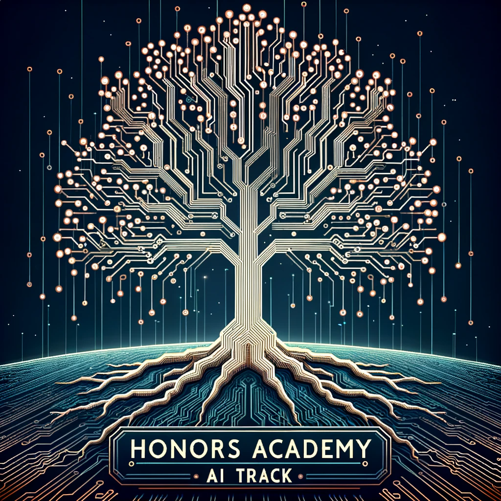

# Introduction to Deep Learning for HA AI Track - A Curriculum

> 🤩  Welcome to the Honors Academy AI Track Resource Hub! 🤩

Dive into the world of  **Deep Learning** with the  **Eindhoven University of Technology's Honors Academy AI Track **. This dedicated platform is tailored to provide our ambitious students with a comprehensive collection of materials, insights, and tools to excel in their AI endeavors. Whether you're embarking on a deep learning journey or exploring the intricacies of machine learning, our curated resources are here to guide you every step of the way.

Our commitment is to ensure that you have a solid foundation to kickstart your projects. From essential basics to advanced techniques, our materials encompass a wide spectrum of AI knowledge. Moreover, our expertly crafted tips and tricks are designed to enhance your project's efficiency and effectiveness. But that's not all! Dive deeper with our additional resources that offer a broader perspective and connect theoretical knowledge with practical application.

Embrace the future of AI with confidence. Let's embark on this transformative journey together, harnessing the power of technology to innovate, inspire, and impact. Welcome to the Honors Academy AI Track of the Eindhoven University of Technology.

**✍️ Hearty thanks to our authors** Simon, Angelos, Austin, Sytze

---

# Getting Started

This repository includes pages with introductory tutiruals and materials that are crucial for the AI Track projects.
The curriculum does not include all but necessary materials on deep leanring in Python as well as useful tips from the 2022-2023 HA AI Track members. In case you see there is more to be added, feel free to contribute and extend the materials or link your own project for reference in the topics. 

> For further study, we recommend following these [Stanford lectures](https://www.youtube.com/watch?v=vT1JzLTH4G4&list=PLf7L7Kg8_FNxHATtLwDceyh72QQL9pvpQ&index=1) and [TU/e Master's course on computer vision](http://vca.ele.tue.nl/C418-V3-Convolutional-neural-networks-for-computer-vision.html). For Pytorch either refer to our introduction tutorial on these pages or the introduction on [Pytorch website](https://pytorch.org/tutorials/beginner/deep_learning_60min_blitz.html)

## Important Dates and Deadlines of Honors Academy 2023-2024

This is an overview of the important dates and deadlines for the year 2023 and 2024 of the current Honors Academy members. For further information please refer to Canvas of Honors Academy.

| Date               | Activity                                                                                                          | For                                                               |
|--------------------|-------------------------------------------------------------------------------------------------------------------|-------------------------------------------------------------------|
| September 8, 2023  | Registration workshop Managing your own development                                                                | First year Honors Bachelor students                               |
| October 27, 2023   | Draft PDP and Project brief to coach by e-mail                                                                     | All Honors Bachelor students                                      |
| November 8, 2023   | Feedback PDP and Project brief to students by e-mail                                                               | All coaches                                                       |
| November 13, 2023  | Registration Inspiration event Personal Development                                                                | All Honors Bachelor students                                      |
| December 1, 2023   | PDP and Project brief, upload on Canvas                                                                            | All Honors Bachelor students                                      |
| December 1, 2023   | Project info form, upload on Canvas                                                                                | All Honors Bachelor students                                      |
| May 1, 2024        | Graduation Form Honors Bachelor Program, upload on Canvas                                                          | Second year Honors Bachelor students                              |
| May 12, 2024       | Application letter to new track coordinator 2023-2024 (round 1)                                                   | Honors Bachelor students who like to switch after year 1          |
| May 13, 2024       | Yearbook deliverables                                                                                             | Honors Bachelor students appointed as editors by the Honors office|
| May 26, 2024       | Assessment deliverables, upload on Canvas                                                                          | All Honors Bachelor students                                      |
| June 17, 2024      | Inform student of decision track switch (round 1)                                                                  | Honors office                                                     |
| June 24, 2024      | Send in request for switch to honorsacademy@tue.nl (round 2)                                                       | Honors Bachelor students who like to switch after year 1          |
| June 25, 2024      | Inform student if switch request is possible (round 2)                                                             | Honors office                                                     |
| June 27, 2024      | Application letter to new track coordinator 2023-2024 (round 2)                                                   | Honors Bachelor students who like to switch after year 1          |
| July 4, 2024       | Assessment results in Osiris                                                                                       | Honors office                                                     |
| July 8, 2024       | Inform student of decision track switch (round 2)                                                                  | Honors office                                                     |

> Check Canvas for informaiton on whether PDP and project brief are sent directly to navas or also to coach.

| Lesson Number |     Topic     | Learning objectives     |        Linked Lesson    | Author     |
| ----------- | ---------- | ---------------------- | -------------------- | ---------- |
|      01       |              Introduction lecture Deep Learning               |      [Slides](Convolutional_Neural_Networks_lecture.pdf)       | Introduction to Deep learning                                          |                                             ...                                             |                       Simon Austin Angelos                     |
|      01       |              Introduction to Neural Networks                |      [Page](1-NN/README.md)       | Understand the idea of neural networks                                           |                                             ...                                             |                       Sytze                       |
|      02       |              ⚡️ Introduction to Pytorch ⚡️                |      [Page](2-Introduction/README.md)       | Learn the basic concepts of deep learning using Pytorch                                           |                                             ...                                             |                       Simon                       |
|      03       |               Introduction to CNNs in Pytorch                |      [Page](3-CNN/README.md)       | Imlementing CNNs for computer vision in Pytorch                                           |                                             ...                                             |                       Simon                       |
|      04       |               Q&A              |      [Page](4-Q&A/README.md)       |Answers to questions you might ask during the projects                                           |                                             ...                                             |                       Simon                       |

## Other Curricula

Microsoft introductory machine learning courses available for free on GutHub. Check out:

- [Web Dev for Beginners](https://aka.ms/webdev-beginners)
- [IoT for Beginners](https://aka.ms/iot-beginners)
- [Data Science for Beginners](https://aka.ms/datascience-beginners)
- [AI for Beginners](https://aka.ms/ai-beginners)

## Invitation to Contribute

Hello there track members! 👋

We would like to let you know that this project is open for contributions for you fellow track members! The contirbution can be anythig from formatting changes to makin a fancy logo for our track (see the following to get inspired). You can contact Simon or ay other of the current contributors (see above).

